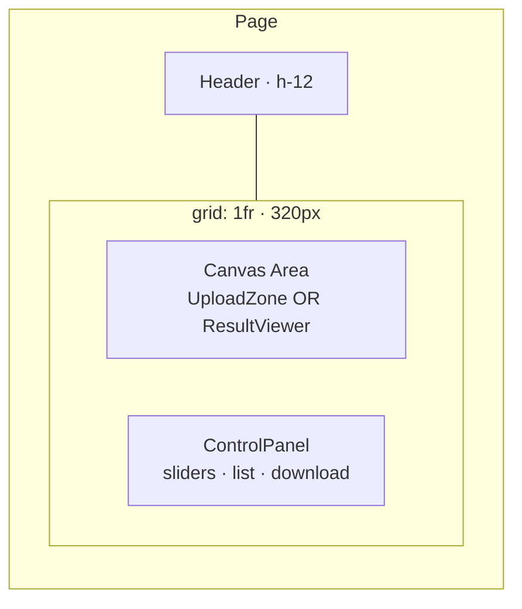
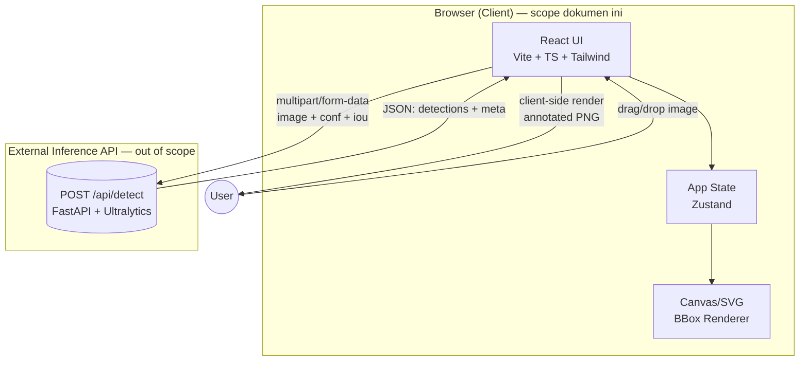
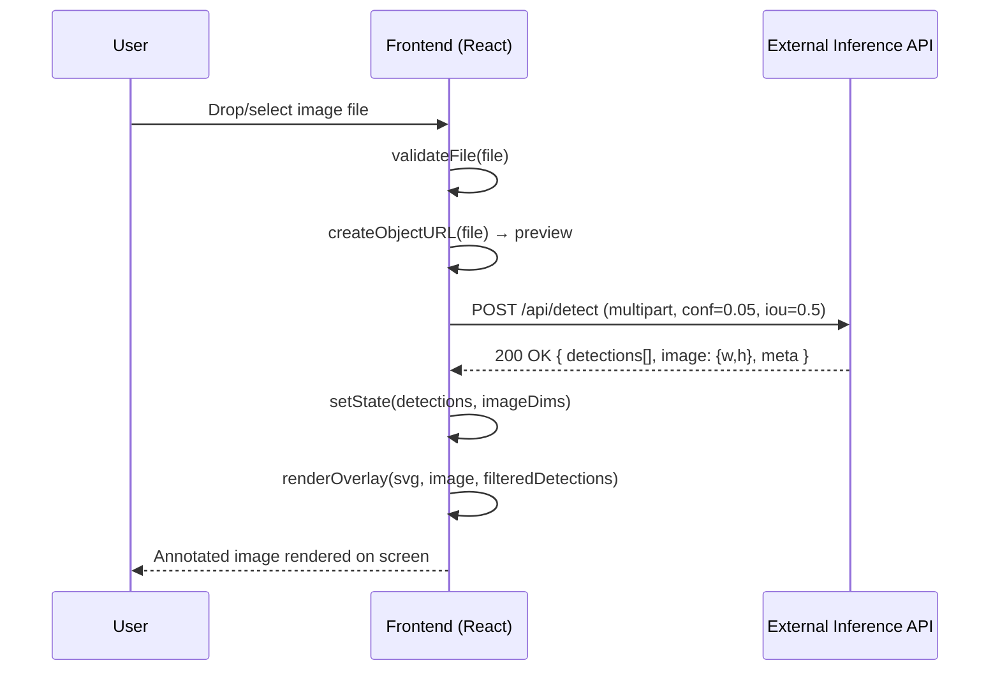
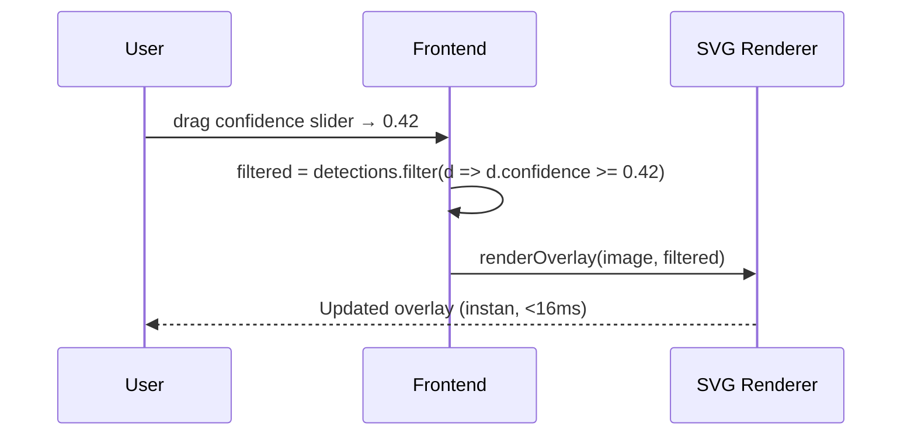
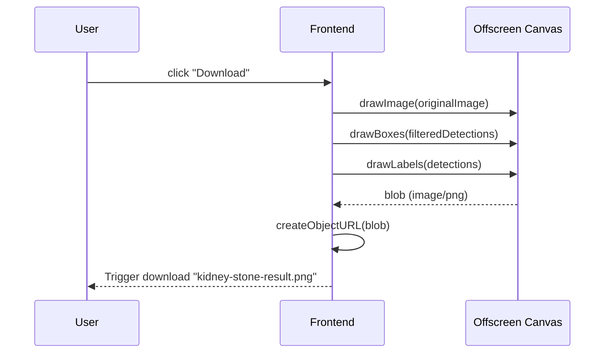
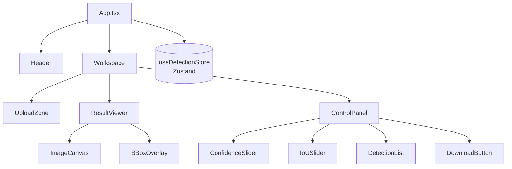

# Design Document: Kidney Stone Detection Frontend

## Overview

Dokumen ini mendesain **antarmuka web (UI/UX + frontend)** untuk men-deploy model YOLO `best.pt` (single-class: `stone`) yang sudah dilatih untuk mendeteksi batu ginjal pada citra CT. Pengguna dapat mengunggah gambar, melihat hasil deteksi secara visual dengan bounding box yang dirender real-time di atas gambar (mirip pengalaman "Try the model" di Roboflow), menyesuaikan threshold confidence dan IoU, melihat daftar deteksi pada sidebar, lalu mengunduh gambar hasil yang sudah teranotasi.

Lingkup desain ini **hanya frontend**: UI/UX, struktur komponen React, state management, rendering overlay, dan interaksi pengguna. Backend inference (FastAPI + Ultralytics yang membungkus `best.pt`) **diperlakukan sebagai layanan HTTP eksternal** — frontend hanya bergantung pada *API contract* yang didokumentasikan di section "External API Contract". Implementasi backend di luar scope dokumen ini.

Tidak ada database — MVP ini stateless dan single-user di sisi frontend. Frontend memanggil backend sekali per gambar dengan `conf` rendah, lalu memfilter hasil secara lokal saat slider digeser sehingga pengalaman terasa instan.

---

## 🚧 Backend Out of Scope

> **Catatan penting:** Backend inference akan dibangun secara terpisah oleh pengguna sebagai latihan belajar (FastAPI + Ultralytics + `best.pt`). Dokumen ini **tidak** mendesain internal backend (tidak ada arsitektur Python class, tidak ada implementasi route, tidak ada pemilihan dependency Python).
>
> Yang **didefinisikan** di sini hanyalah **kontrak HTTP** yang frontend asumsikan ada — request shape, response JSON schema, dan status code. Selama backend yang dibangun mematuhi kontrak ini, frontend akan berfungsi tanpa modifikasi.
>
> Pertanyaan implementasi backend (cara load model, cara serialisasi `Results`, deployment, performa GPU/CPU, rate limiting) akan dibahas di sesi pembelajaran terpisah, bukan di spec ini.

---

## UI/UX Design

Section ini mendefinisikan tampilan visual, layout, state UI, pola interaksi, aksesibilitas, dan responsivitas. Tujuannya: memberi pedoman cukup detail agar implementasi React + Tailwind dapat berjalan tanpa keputusan visual yang ambigu.

### Wireframe Layout (Desktop, ≥ md breakpoint)

Layout meniru Roboflow "Try the model": **header tipis di atas**, **canvas hasil deteksi mengisi area utama (kiri)**, **panel kontrol di sebelah kanan** (slider + daftar deteksi + tombol unduh).

```
┌──────────────────────────────────────────────────────────────────────┐
│  🪨  Kidney Stone Detection            v1.0 · best.pt · single-class │  ← Header (h-12)
├────────────────────────────────────────────────┬─────────────────────┤
│                                                │  CONTROLS           │
│                                                │                     │
│            ┌────────────────────────┐          │  Confidence         │
│            │                        │          │  ──●─────────  0.25 │
│            │      [CT image]        │          │                     │
│            │      ┌──────┐          │          │  IoU                │
│            │      │ ▢ stone 87%     │          │  ──────●─────  0.50 │
│            │      └──────┘          │          │  ⟳ Re-run inference │
│            │                        │          │                     │
│            └────────────────────────┘          │  Detections (3)     │
│                                                │  ─────────────────  │
│                                                │  #1 stone  87.4%    │
│                                                │  #2 stone  62.1%    │
│                                                │  #3 stone  31.5%    │
│                                                │                     │
│            (drag a new image to replace)       │  ⬇  Download PNG    │
│                                                │                     │
└────────────────────────────────────────────────┴─────────────────────┘
        Main canvas area (1fr)                       Side panel (320px)
```



### Visual Design Tokens

This design system is engineered for medical diagnostic environments where clarity, speed of cognition, and a sense of sterile reliability are paramount. The Brand & Style follows a Corporate / Modern style with a focus on high-contrast "Medical Minimalism." By utilizing a "Teal Clinical" palette against vast white space, the UI prioritizes data density without sacrificing legibility.

#### Color Palette (Material 3 roles from stitch.md):

```yaml
colors:
  surface: '#f6fafe'
  surface-dim: '#d6dade'
  surface-bright: '#f6fafe'
  surface-container-lowest: '#ffffff'
  surface-container-low: '#f0f4f8'
  surface-container: '#eaeef2'
  surface-container-high: '#e4e9ed'
  surface-container-highest: '#dfe3e7'
  on-surface: '#171c1f'
  on-surface-variant: '#3d4946'
  inverse-surface: '#2c3134'
  inverse-on-surface: '#edf1f5'
  outline: '#6d7a77'
  outline-variant: '#bcc9c5'
  surface-tint: '#006b5f'
  primary: '#00685d'
  on-primary: '#ffffff'
  primary-container: '#008376'
  on-primary-container: '#f4fffb'
  inverse-primary: '#70d8c8'
  secondary: '#705d00'
  on-secondary: '#ffffff'
  secondary-container: '#fcd400'
  on-secondary-container: '#6e5c00'
  tertiary: '#545c72'
  on-tertiary: '#ffffff'
  tertiary-container: '#6c748b'
  on-tertiary-container: '#fefcff'
  error: '#ba1a1a'
  on-error: '#ffffff'
  error-container: '#ffdad6'
  on-error-container: '#93000a'
  background: '#f6fafe'
  on-background: '#171c1f'
  surface-variant: '#dfe3e7'
```

#### Typography Scale:

- **display-lg:** `font-family: Inter; font-size: 32px; font-weight: 700; line-height: 40px; letter-spacing: -0.02em`
- **display-lg-mobile:** `font-family: Inter; font-size: 24px; font-weight: 700; line-height: 32px; letter-spacing: -0.02em`
- **headline-md:** `font-family: Inter; font-size: 24px; font-weight: 600; line-height: 32px; letter-spacing: -0.01em`
- **headline-sm:** `font-family: Inter; font-size: 20px; font-weight: 600; line-height: 28px`
- **body-lg:** `font-family: Inter; font-size: 16px; font-weight: 400; line-height: 24px`
- **body-md:** `font-family: Inter; font-size: 14px; font-weight: 400; line-height: 20px`
- **label-md:** `font-family: Inter; font-size: 12px; font-weight: 600; line-height: 16px; letter-spacing: 0.05em`
- **code-mono:** `font-family: JetBrains Mono; font-size: 13px; font-weight: 400; line-height: 18px`

#### Rounded & Shapes:
- **sm:** `0.25rem` (4px) for checkboxes and tags.
- **DEFAULT:** `0.5rem` (8px) for buttons, inputs, slider thumb.
- **md:** `0.75rem` (12px) for list items.
- **lg:** `1rem` (16px) for main dashboard panels / cards.
- **xl:** `1.5rem` (24px) for modal overlays.
- **full:** `9999px` for pill badges.

#### Spacing & Layout:
- Spacing follows a strict 4px baseline grid (`base: 4px`).
- **xs:** `0.25rem` (4px)
- **sm:** `0.5rem` (8px)
- **md:** `1rem` (16px)
- **lg:** `1.5rem` (24px)
- **xl:** `2.5rem` (40px)
- **gutter:** `1.5rem` (24px)
- **margin:** `2rem` (32px)
- Grid utama: `grid grid-cols-[1fr_340px] gap-24px p-24px h-screen`.

#### Bounding Box & Highlight Colors:
- **Header:** Latar belakang putih (`#ffffff`) dengan outline bawah hijau (`2px solid #00685d`). Logo/emoji `🪨` dihilangkan untuk tampilan minimalis yang bersih.
- **Bounding Box Stroke:** `#00685d` (Primary Teal) / `#008376` (Primary Container Teal).
- **Bounding Box Fill (Active/Hover):** rgba(0, 104, 93, 0.08)
- **Tombol Utama (CTA):** `#fcd400` (Secondary Container Gold) dengan teks `#6e5c00` (On Secondary Container).
- **Tombol Secondary:** `#00685d` (Primary Teal) dengan teks `#ffffff` (On Primary).
- **Ghost Button:** Border `#00685d` 1px dengan teks `#00685d`.
- **Active State Border:** 2px stroke `#00685d` (Primary Teal).
- **Highlight Detection List:** `#eaeef2` (Surface Container) dengan border `#00685d`.


### UI States

Setiap state harus terbaca jelas dari satu pandangan:

#### 1. Empty (idle) state — sebelum upload

- Canvas area menampilkan **drop-zone** ukuran besar:
  - Border `border-2 border-dashed border-slate-300`, hover → `border-sky-500 bg-sky-50`.
  - Icon upload (32px) di tengah, di bawahnya teks `Drag & drop a CT image here` + sub-text `or click to browse · PNG, JPEG, BMP, TIFF · max 20 MB`.
- Panel kontrol **disabled secara visual** (slider abu-abu, tombol download grayed). Daftar deteksi: placeholder "Upload an image to start".

#### 2. Loading (inferring) state — setelah upload, menunggu API

- Canvas menampilkan preview gambar (sudah di-create object URL) dengan **skeleton overlay** semi-transparan + spinner di tengah.
- Caption di bawah gambar: `Running detection…` (text-sky-600).
- Panel kontrol: slider tetap interaktif (memungkinkan user menggeser sebelum hasil tiba), tapi list deteksi menampilkan 3 baris skeleton `bg-slate-200 animate-pulse`.
- Cancel tidak disediakan di MVP; request inference biasanya selesai < 3 detik.

#### 3. Ready state — hasil sudah ada

- Canvas menampilkan gambar + SVG overlay dengan bbox berwarna amber.
- Panel kontrol fully aktif:
  - Slider menampilkan nilai numerik (mis. `0.25`) di kanan label.
  - List deteksi menampilkan tiap baris: nomor urut, nama kelas, persentase, dimensi bbox.
  - Tombol Download enabled (filled, `bg-slate-900 text-white`).
- Footer kecil di bawah gambar: `Inference: 842ms · 1280px · 3 detections at conf ≥ 0.05`.

#### 4. Error state — API gagal / file invalid

- Banner merah di atas canvas: `<div role="alert" class="rounded-md bg-red-50 border border-red-200 p-3 text-sm text-red-700">…</div>`.
- Pesan spesifik (mis. "Tidak dapat menghubungi server inference. Pastikan backend berjalan di port 8000.").
- Tombol "Coba lagi" di samping pesan jika error berasal dari network (memanggil `runInference()` tanpa upload ulang).
- Gambar dan slider tetap terlihat agar user dapat mengulang tanpa memilih file lagi.

#### 5. No-detection state — model mengembalikan list kosong / threshold terlalu tinggi

- Canvas menampilkan gambar tanpa overlay.
- Panel daftar deteksi: empty state ramah `🔍 No stones detected at confidence ≥ 0.25. Try lowering the slider.`
- Tombol Download disabled karena tidak ada anotasi yang berguna.

### Interaction Patterns

**Drag-and-drop affordance**:

- Saat user mulai men-drag file di atas window → drop-zone bereaksi: border berubah ke `border-sky-500`, background `bg-sky-50`, dan teks berubah jadi `Drop to upload`.
- Saat drop di luar zone → tidak ada efek (bukan accident upload).
- Saat sudah ada gambar dan user men-drag file baru → seluruh canvas area berubah jadi drop-zone overlay (semi-transparan) dengan teks `Drop to replace current image`.

**Slider feedback**:

- Confidence slider: realtime, debounce 0ms (filter lokal cukup cepat). Nilai numerik di kanan label update setiap event `input`.
- IoU slider: debounce 250ms. Saat dirilis, tampilkan tooltip kecil `Click "Re-run inference" to apply` jika nilainya berbeda > 0.05 dari nilai terakhir yang dikirim ke backend (IoU mempengaruhi NMS yang dilakukan backend, jadi perlu re-inference).
- Keduanya menampilkan track terisi dari kiri sampai thumb (`bg-sky-500`), sisanya `bg-slate-200`.

**Hover synchronization**:

- Hover di SVG `<rect>` → set `hoveredId` di store → baris di `DetectionList` dapat highlight (`bg-amber-50`).
- Hover di baris `DetectionList` → set `hoveredId` → bbox terkait stroke menebal jadi 3px dan stroke color berubah ke `amber-600`.
- `hoveredId` keluar saat mouseleave dari kedua sisi.

**Download button affordance**:

- Default: `bg-slate-900 text-white hover:bg-slate-800`, icon download di kiri label.
- Disabled (no detections / no image): `bg-slate-200 text-slate-400 cursor-not-allowed`, dengan tooltip `Upload an image first` atau `No detections to download`.
- Saat klik, button menampilkan spinner kecil (~100ms) selama canvas di-render — biasanya tidak terlihat tapi mencegah double-click.
- Setelah berhasil: tampilkan toast singkat `Saved kidney-stone-result.png` (3 detik).

### Accessibility (WCAG 2.1 AA target)

- **Keyboard navigation**:
  - Tab order: Header → drop-zone (saat empty) atau gambar (saat ready) → slider confidence → slider IoU → re-run button → daftar deteksi (item-by-item) → download button.
  - Drop-zone harus `role="button" tabIndex={0}` + handle `Enter`/`Space` untuk membuka file dialog.
  - Slider native `<input type="range">` mendukung Arrow keys (`Step=0.01`), `Home`/`End` ke 0/1.
- **ARIA roles**:
  - `<main role="main">`, panel kontrol `<aside aria-label="Detection controls">`.
  - Banner error: `role="alert"` + `aria-live="assertive"`.
  - Daftar deteksi: `<ul role="list">`, item `<li role="listitem">` dengan `aria-label="Detection 1, stone, 87 percent confidence"`.
  - SVG overlay: `<svg role="img" aria-label="Detection overlay with N bounding boxes">`.
- **Focus states**: gunakan `focus-visible:ring-2 focus-visible:ring-sky-500 focus-visible:ring-offset-2`. Jangan hapus default outline tanpa pengganti.
- **Color contrast**:
  - Text `slate-900` di `slate-50` ≈ 16:1 (lulus AAA).
  - Label bbox `white` di `amber-500` ≈ 2.6:1 — **catatan**: kombinasi ini lulus large-text saja. Untuk label di atas amber, gunakan **font-weight 600 + size ≥ 14px** atau ganti background label ke `amber-700` (kontras 5.0:1 dengan white) saat label perlu dibaca jelas.
- **Reduced motion**: hormati `prefers-reduced-motion: reduce` — disable `animate-pulse` skeleton dan transition slider, ganti dengan static state.

### Responsive Behavior

Dua breakpoint utama (Tailwind default `md = 768px`):

| Breakpoint        | Layout                                                                 |
|-------------------|------------------------------------------------------------------------|
| `< md` (mobile)   | Stack vertikal: header → canvas (full width) → panel kontrol di bawah. Slider tetap full-width. List deteksi collapse jadi `<details>` summary "3 detections" yang dapat di-expand. |
| `>= md` (desktop) | Grid 2 kolom `[1fr_320px]` seperti wireframe.                          |
| `>= xl` (≥1280px) | Panel naik jadi `360px`, font heading naik 1 step.                     |

Canvas mempertahankan **aspect-ratio gambar asli** dengan `object-contain`; tidak pernah crop atau stretch — penting untuk konteks medis. Pada layar sempit, gambar mengisi lebar viewport dan tinggi auto.

---

## Architecture



**Prinsip arsitektur frontend:**

- **Anotasi di client.** Backend mengembalikan koordinat bounding box dalam JSON; frontend yang menggambar overlay di Canvas/SVG. Slider confidence terasa instan tanpa round-trip ke server.
- **Re-inference hanya saat threshold IoU diubah signifikan / model atau gambar ganti.** Backend dipanggil dengan `conf` rendah (0.05) sekali saja per gambar; UI memfilter hasil secara lokal.
- **Download dihasilkan client-side.** Gambar teranotasi di-render ke offscreen canvas lalu diekspor sebagai PNG melalui `canvas.toBlob()`.
- **Stateless di sisi client.** Tidak ada persistence antar reload (refresh = reset). Object URL di-revoke saat gambar diganti.

---

## External API Contract

Section ini mendokumentasikan **kontrak HTTP yang frontend asumsikan ada**. User akan mengimplementasikan service ini secara terpisah; frontend tidak peduli bagaimana caranya selama kontrak berikut dipatuhi.

### Endpoint

```
POST /api/detect
Content-Type: multipart/form-data
```

### Request fields (multipart)

| Field    | Type      | Wajib | Catatan                                                              |
|----------|-----------|-------|----------------------------------------------------------------------|
| `image`  | file      | ya    | MIME ∈ {`image/png`, `image/jpeg`, `image/bmp`, `image/tiff`}, ≤ 20MB |
| `conf`   | string→float | tidak (default 0.05) | Range `[0.0, 1.0]`. Frontend selalu kirim 0.05 supaya bisa difilter lokal. |
| `iou`    | string→float | tidak (default 0.5)  | Range `[0.0, 1.0]`. NMS threshold di-apply oleh backend.             |
| `imgsz`  | string→int   | tidak (default 1280) | Salah satu dari `{320, 640, 1024, 1280, 1536}`.                      |

### Response — `200 OK`

```jsonc
{
  "detections": [
    {
      "class_id": 0,
      "class_name": "stone",
      "confidence": 0.874,
      "bbox": { "x": 123.0, "y": 45.0, "width": 87.0, "height": 135.0 }
    }
    // ... 0..N entries
  ],
  "image": { "width": 1024, "height": 768 },
  "meta": {
    "inference_ms": 842.3,
    "model_imgsz": 1280,
    "conf_threshold": 0.05,
    "iou_threshold": 0.5
  }
}
```

**Constraints yang frontend validasikan**:

- `image.width > 0 && image.height > 0` dan cocok dengan `naturalWidth/Height` gambar yang di-upload.
- Untuk setiap detection: `0 <= confidence <= 1`, koordinat bbox dalam piksel asli (bukan ternormalisasi), `bbox.x + bbox.width <= image.width`, `bbox.y + bbox.height <= image.height`, `width > 0`, `height > 0`.

### Error responses

| Status | Body                            | Penyebab umum                                       |
|--------|---------------------------------|------------------------------------------------------|
| `400`  | `{ "detail": "<reason>" }`      | MIME tidak didukung, conf/iou di luar range, gambar tidak terdecode |
| `413`  | `{ "detail": "Payload too large" }` | File > 20MB (jika dienforce di backend / proxy)  |
| `422`  | FastAPI default validation error | Field hilang / tipe salah                         |
| `500`  | `{ "detail": "<reason>" }`      | Inference error internal                             |
| network error | —                        | Backend tidak berjalan / unreachable                 |

Frontend menampilkan `detail` apa adanya di banner error untuk 4xx/5xx, dan pesan generik "Tidak dapat menghubungi server inference" untuk network error.

### CORS

Frontend di dev berjalan di `http://localhost:5173` (Vite). Backend harus mengizinkan origin ini di header CORS. Saat dev, frontend menggunakan Vite proxy `/api → http://localhost:8000` sehingga browser melihat same-origin dan CORS tidak relevan.

---

## Sequence Diagrams

Backend digambarkan sebagai **black box** (`External Inference API`) — diagram fokus pada round-trip dan flow di sisi frontend.

### Alur 1: Upload → Inference → Visualisasi



### Alur 2: Slider Confidence (tanpa re-inference)



### Alur 3: Download Hasil



---

## Components and Interfaces

### Komponen Frontend (React + TypeScript)



### Component 1: `UploadZone`

**Purpose**: Drag-and-drop area + file picker untuk gambar input. Memvalidasi MIME type dan ukuran sebelum dikirim.

**Interface**:

```typescript
interface UploadZoneProps {
  onFileAccepted: (file: File) => void
  isUploading: boolean
  maxSizeMB?: number          // default 20
  acceptedTypes?: string[]    // default ["image/png","image/jpeg","image/bmp","image/tiff"]
}
```

**Responsibilities**:
- Tangani event `dragover`, `dragleave`, `drop`, dan klik untuk membuka file dialog.
- Validasi `file.type` ada di `acceptedTypes` dan `file.size <= maxSizeMB * 1024 * 1024`.
- Tampilkan pesan error inline jika validasi gagal.
- Tampilkan spinner ketika `isUploading` true.

### Component 2: `ResultViewer`

**Purpose**: Menampilkan gambar asli dengan overlay bounding box yang dapat di-zoom/pan, mirip "Try the model" Roboflow.

**Interface**:

```typescript
interface ResultViewerProps {
  imageUrl: string | null            // object URL dari File
  imageDims: { width: number; height: number } | null
  detections: Detection[]            // sudah difilter oleh confidence threshold
  hoveredId: string | null
  onHoverDetection: (id: string | null) => void
}
```

**Responsibilities**:
- Render `` (atau bitmap di canvas) dalam aspect-ratio container.
- Render overlay SVG di atas gambar dengan koordinat di-scale dari piksel asli ke piksel tampilan.
- Highlight bbox yang sedang di-hover di sidebar.
- Tampilkan placeholder kosong saat `imageUrl` null.

### Component 3: `BBoxOverlay`

**Purpose**: SVG layer yang menggambar kotak deteksi, label kelas, dan persentase confidence.

**Interface**:

```typescript
interface BBoxOverlayProps {
  detections: Detection[]
  imageDims: { width: number; height: number }
  displayDims: { width: number; height: number }
  hoveredId: string | null
}
```

**Responsibilities**:
- Untuk setiap deteksi, gambar `<rect>` dengan koordinat di-scale.
- Gambar label `stone 87%` di atas atau di bawah kotak (di bawah jika kotak ada di tepi atas).
- Warna kotak konsisten per kelas (single class: `amber-500`).
- Tebalkan stroke saat `detection.id === hoveredId`.

### Component 4: `ControlPanel`

**Purpose**: Sidebar kanan berisi slider, daftar deteksi, dan tombol download.

**Interface**:

```typescript
interface ControlPanelProps {
  rawDetections: Detection[]            // semua deteksi dari backend (conf >= 0.05)
  confidenceThreshold: number           // 0..1
  iouThreshold: number                  // 0..1 (display-only, NMS ditangani backend)
  onConfidenceChange: (v: number) => void
  onIoUChange: (v: number) => void
  onDownload: () => void
  onReinfer: () => void                 // dipanggil jika iou diubah signifikan
  hoveredId: string | null
  onHoverDetection: (id: string | null) => void
}
```

**Responsibilities**:
- Komposisi `ConfidenceSlider`, `IoUSlider`, `DetectionList`, `DownloadButton`.
- Hitung deteksi terfilter `rawDetections.filter(d => d.confidence >= confidenceThreshold)`.
- Disable `DownloadButton` jika tidak ada deteksi atau gambar belum dimuat.

### Component 5: `ConfidenceSlider`

**Interface**:

```typescript
interface ConfidenceSliderProps {
  value: number              // 0..1
  onChange: (v: number) => void
  step?: number              // default 0.01
  label?: string             // default "Confidence threshold"
}
```

### Component 6: `DetectionList`

**Interface**:

```typescript
interface DetectionListProps {
  detections: Detection[]
  hoveredId: string | null
  onHover: (id: string | null) => void
}
```

**Responsibilities**:
- Tampilkan tiap deteksi sebagai baris: `#1  stone  87.4%  [123,45,210,180]`.
- Mendukung hover dua arah dengan `BBoxOverlay`.
- Urutkan berdasarkan confidence menurun.

### Component 7: `DownloadButton`

**Interface**:

```typescript
interface DownloadButtonProps {
  imageElement: HTMLImageElement | null
  detections: Detection[]              // sudah difilter
  imageDims: { width: number; height: number }
  filename?: string                    // default "kidney-stone-result.png"
  disabled?: boolean
}
```

**Responsibilities**:
- Saat diklik: buat offscreen `<canvas>` seukuran `imageDims`, gambar gambar asli, gambar bbox + label, ekspor `toBlob('image/png')`, lalu trigger `<a download>` programatik.

---

## Data Models

### Model 1: `Detection`

```typescript
interface Detection {
  id: string                  // uuid v4 (di-generate frontend)
  classId: number             // 0 untuk "stone"
  className: string           // "stone"
  confidence: number          // 0..1
  bbox: BBox                  // koordinat piksel asli (bukan dinormalisasi)
}

interface BBox {
  x: number                   // top-left x, piksel, >= 0
  y: number                   // top-left y, piksel, >= 0
  width: number               // > 0
  height: number              // > 0
}
```

**Validation Rules**:
- `0 <= confidence <= 1`
- `bbox.x >= 0 && bbox.y >= 0`
- `bbox.x + bbox.width <= imageDims.width`
- `bbox.y + bbox.height <= imageDims.height`
- `bbox.width > 0 && bbox.height > 0`

### Model 2: `DetectionResponse` (dari External Inference API)

```typescript
interface DetectionResponse {
  detections: Array<{
    class_id: number
    class_name: string
    confidence: number
    bbox: { x: number; y: number; width: number; height: number }  // pixels
  }>
  image: {
    width: number
    height: number
  }
  meta: {
    inference_ms: number
    model_imgsz: number
    conf_threshold: number
    iou_threshold: number
  }
}
```

**Validation Rules** (di-enforce frontend saat parse response):
- `image.width > 0 && image.height > 0`.
- Untuk setiap detection: `0 <= confidence <= 1`, semua bbox berada dalam batas `image.width × image.height`.

### Model 3: `AppState` (Zustand store)

```typescript
interface AppState {
  // input
  file: File | null
  imageUrl: string | null              // object URL
  imageDims: { width: number; height: number } | null
  imageElement: HTMLImageElement | null

  // inference result (raw, conf >= 0.05)
  rawDetections: Detection[]
  meta: DetectionResponse['meta'] | null

  // ui controls
  confidenceThreshold: number          // default 0.25
  iouThreshold: number                 // default 0.5
  hoveredId: string | null

  // status
  status: 'idle' | 'uploading' | 'inferring' | 'ready' | 'error'
  errorMessage: string | null

  // actions
  setFile: (f: File) => Promise<void>
  runInference: () => Promise<void>
  setConfidenceThreshold: (v: number) => void
  setIoUThreshold: (v: number) => void
  setHoveredId: (id: string | null) => void
  reset: () => void
}
```

---

## Algorithmic Pseudocode (Frontend)

### Algoritma 1: Upload + Inference

```pascal
ALGORITHM handleFileUpload(file)
INPUT: file of type File
OUTPUT: void (mutates store)

BEGIN
  ASSERT file IS NOT NULL

  // Step 1: Validasi
  IF file.size > MAX_SIZE_BYTES THEN
    store.setError("File terlalu besar (>20MB)")
    RETURN
  END IF

  IF file.type NOT IN ALLOWED_MIME_TYPES THEN
    store.setError("Format tidak didukung. Gunakan PNG/JPEG/BMP/TIFF")
    RETURN
  END IF

  // Step 2: Buat preview
  IF store.imageUrl IS NOT NULL THEN
    URL.revokeObjectURL(store.imageUrl)            // hindari memory leak
  END IF
  url ← URL.createObjectURL(file)

  // Step 3: Probe dimensi gambar
  img ← NEW Image()
  img.src ← url
  AWAIT img.onload

  ASSERT img.naturalWidth > 0 AND img.naturalHeight > 0

  store.set({
    file: file,
    imageUrl: url,
    imageDims: { width: img.naturalWidth, height: img.naturalHeight },
    imageElement: img,
    status: 'inferring',
    rawDetections: []
  })

  // Step 4: Trigger inference
  AWAIT runInference()
END
```

**Preconditions:**
- `file` adalah objek `File` valid dari event drop atau input.
- `MAX_SIZE_BYTES = 20 * 1024 * 1024` dan `ALLOWED_MIME_TYPES` terdefinisi.

**Postconditions:**
- Jika valid: `store.imageUrl`, `store.imageDims`, dan `store.imageElement` ter-set; `runInference` dipanggil.
- Jika invalid: `store.errorMessage` ter-set, state lain tidak berubah.
- Object URL sebelumnya di-revoke (no leak).

### Algoritma 2: Inference Call

```pascal
ALGORITHM runInference()
INPUT: none (membaca dari store)
OUTPUT: void

BEGIN
  ASSERT store.file IS NOT NULL
  ASSERT store.imageDims IS NOT NULL

  formData ← NEW FormData()
  formData.append("image", store.file)
  formData.append("conf", "0.05")                   // raw conf, di-filter UI
  formData.append("iou", String(store.iouThreshold))
  formData.append("imgsz", "1280")

  TRY
    response ← AWAIT fetch("/api/detect", { method: "POST", body: formData })

    IF response.status NOT IN [200] THEN
      body ← AWAIT response.json()
      store.setError(body.detail OR "Inference gagal")
      RETURN
    END IF

    payload ← AWAIT response.json()                 // DetectionResponse

    ASSERT payload.image.width = store.imageDims.width
    ASSERT payload.image.height = store.imageDims.height

    raw ← []
    FOR each d IN payload.detections DO
      ASSERT 0 <= d.confidence <= 1
      ASSERT d.bbox.x >= 0 AND d.bbox.y >= 0
      ASSERT d.bbox.x + d.bbox.width <= payload.image.width
      ASSERT d.bbox.y + d.bbox.height <= payload.image.height

      raw.add({
        id: uuidv4(),
        classId: d.class_id,
        className: d.class_name,
        confidence: d.confidence,
        bbox: d.bbox
      })
    END FOR

    store.set({
      rawDetections: raw,
      meta: payload.meta,
      status: 'ready',
      errorMessage: null
    })
  CATCH err
    store.setError("Tidak dapat menghubungi server inference: " + err.message)
  END TRY
END
```

**Preconditions:**
- `store.file` dan `store.imageDims` sudah ter-set oleh `handleFileUpload`.
- Endpoint `/api/detect` (External Inference API) tersedia dan menerima multipart/form-data sesuai kontrak.

**Postconditions:**
- Jika sukses: `store.rawDetections` berisi 0..N deteksi dengan id unik dan koordinat valid; `store.status = 'ready'`.
- Jika gagal: `store.status = 'error'` dengan `errorMessage` deskriptif; `rawDetections` tidak di-overwrite dengan data parsial.

**Loop Invariants (di FOR each detection):**
- Semua deteksi yang sudah ditambahkan ke `raw` memenuhi semua constraint validasi.
- Tidak ada `id` duplikat di `raw`.

### Algoritma 3: Filter & Render Overlay

```pascal
ALGORITHM renderOverlay(svg, rawDetections, threshold, imageDims, displayDims, hoveredId)
INPUT:
  svg of type SVGElement
  rawDetections: array of Detection
  threshold: number in [0,1]
  imageDims: { width, height }
  displayDims: { width, height }
  hoveredId: string OR null
OUTPUT: void (mutates svg)

BEGIN
  ASSERT imageDims.width > 0 AND imageDims.height > 0
  ASSERT displayDims.width > 0 AND displayDims.height > 0

  scaleX ← displayDims.width / imageDims.width
  scaleY ← displayDims.height / imageDims.height

  clearChildren(svg)

  FOR each d IN rawDetections DO
    INVARIANT: semua child svg sebelumnya sudah valid SVGRectElement
    IF d.confidence < threshold THEN
      CONTINUE
    END IF

    rx ← d.bbox.x * scaleX
    ry ← d.bbox.y * scaleY
    rw ← d.bbox.width * scaleX
    rh ← d.bbox.height * scaleY

    rect ← createSVGRect(rx, ry, rw, rh)
    rect.stroke ← COLOR_STONE
    rect.strokeWidth ← (d.id = hoveredId) ? 3 : 2
    rect.fill ← "none"
    svg.append(rect)

    label ← createSVGText(
      x = rx,
      y = (ry > 14) ? ry - 4 : ry + rh + 14,
      text = d.className + " " + round(d.confidence * 100) + "%"
    )
    svg.append(label)
  END FOR
END
```

**Preconditions:**
- `imageDims` dan `displayDims` valid (positif).
- `rawDetections` dari backend, sudah lulus validasi di `runInference`.

**Postconditions:**
- `svg` berisi tepat `rawDetections.filter(d => d.confidence >= threshold).length` rect + label pasangan.
- Setiap rect berada dalam batas `[0, displayDims.width] × [0, displayDims.height]`.
- Tidak ada rect yang ter-render untuk deteksi di bawah threshold.

**Loop Invariants:**
- Sebelum iterasi ke-k: semua child di `svg` adalah pasangan rect+label yang sah dan koordinatnya konsisten dengan `displayDims`.
- Tidak ada child orphan (rect tanpa label atau sebaliknya) jika algoritma selesai normal.

### Algoritma 4: Generate Annotated Download

```pascal
ALGORITHM generateAnnotatedBlob(imageElement, detections, imageDims)
INPUT:
  imageElement: HTMLImageElement (loaded)
  detections: array of Detection (sudah difilter)
  imageDims: { width, height }
OUTPUT: Blob (image/png)

BEGIN
  ASSERT imageElement.complete = true
  ASSERT imageDims.width > 0 AND imageDims.height > 0

  canvas ← NEW OffscreenCanvas(imageDims.width, imageDims.height)
  ctx ← canvas.getContext("2d")

  // Step 1: Layer gambar asli
  ctx.drawImage(imageElement, 0, 0, imageDims.width, imageDims.height)

  // Step 2: Layer bounding box
  ctx.lineWidth ← max(2, imageDims.width / 500)     // skala dengan resolusi
  ctx.strokeStyle ← COLOR_STONE
  ctx.font ← bold(round(imageDims.width / 60)) + "px sans-serif"

  FOR each d IN detections DO
    ASSERT d.bbox.x + d.bbox.width <= imageDims.width
    ASSERT d.bbox.y + d.bbox.height <= imageDims.height

    ctx.strokeRect(d.bbox.x, d.bbox.y, d.bbox.width, d.bbox.height)

    text ← d.className + " " + round(d.confidence * 100) + "%"
    textMetrics ← ctx.measureText(text)
    pad ← 4

    // background label
    ctx.fillStyle ← COLOR_STONE
    ctx.fillRect(
      d.bbox.x,
      max(0, d.bbox.y - 22),
      textMetrics.width + 2 * pad,
      22
    )

    ctx.fillStyle ← "white"
    ctx.fillText(text, d.bbox.x + pad, max(16, d.bbox.y - 6))
  END FOR

  blob ← AWAIT canvas.convertToBlob({ type: "image/png" })
  ASSERT blob.size > 0
  RETURN blob
END
```

**Preconditions:**
- `imageElement` sudah ter-load (complete = true) dan dapat digambar ke canvas (CORS clean / object URL lokal).
- Semua `detections` punya bbox valid dalam `imageDims`.

**Postconditions:**
- Blob bertipe `image/png` dengan dimensi sama persis seperti gambar asli.
- Kotak dan label terlukis tepat pada koordinat piksel asli (tidak di-scale ulang oleh viewport).

**Loop Invariants:**
- Setelah iterasi ke-k: tepat k pasang (rect + label) telah dilukis ke canvas, semua dalam batas canvas.

---

## Key Functions with Formal Specifications

### Function: `validateFile`

```typescript
function validateFile(file: File): { ok: true } | { ok: false; reason: string }
```

**Preconditions:**
- `file` adalah objek `File` (bukan null, bukan undefined).

**Postconditions:**
- `{ ok: true }` jika dan hanya jika `file.size <= MAX_SIZE_BYTES` DAN `file.type ∈ ALLOWED_MIME_TYPES`.
- Jika `ok: false`, `reason` adalah string non-kosong yang menjelaskan kegagalan.
- Tidak ada side effect.

### Function: `scaleBBoxToDisplay`

```typescript
function scaleBBoxToDisplay(
  bbox: BBox,
  imageDims: { width: number; height: number },
  displayDims: { width: number; height: number }
): BBox
```

**Preconditions:**
- `imageDims.width > 0`, `imageDims.height > 0`.
- `displayDims.width > 0`, `displayDims.height > 0`.
- `bbox` valid: `0 <= bbox.x`, `0 <= bbox.y`, `bbox.x + bbox.width <= imageDims.width`, `bbox.y + bbox.height <= imageDims.height`.

**Postconditions:**
- Output `bbox'` memenuhi: `bbox'.x = bbox.x * (displayDims.width / imageDims.width)` (analog untuk y, width, height).
- Output juga in-bounds untuk `displayDims`.
- Idempoten saat `imageDims === displayDims` (mengembalikan bbox setara, modulo floating point).

### Function: `filterByConfidence`

```typescript
function filterByConfidence(detections: Detection[], threshold: number): Detection[]
```

**Preconditions:**
- `0 <= threshold <= 1`.
- Setiap `d ∈ detections` memenuhi `0 <= d.confidence <= 1`.

**Postconditions:**
- Output adalah subset dari input (tidak ada elemen baru, tidak ada modifikasi).
- `∀ d ∈ output: d.confidence >= threshold`.
- Urutan elemen yang lolos terjaga (stable filter).
- `threshold = 0` ⟹ output sama dengan input.
- `threshold > max(d.confidence)` ⟹ output kosong.

---

## Example Usage (Frontend Sketch)

```typescript
// src/App.tsx — sketsa alur tertinggi
import { useDetectionStore } from './store'
import { UploadZone } from './components/UploadZone'
import { ResultViewer } from './components/ResultViewer'
import { ControlPanel } from './components/ControlPanel'

export function App() {
  const {
    imageUrl, imageDims, imageElement,
    rawDetections, confidenceThreshold, iouThreshold, hoveredId,
    status, errorMessage,
    setFile, setConfidenceThreshold, setIoUThreshold,
    setHoveredId, runInference,
  } = useDetectionStore()

  const filtered = rawDetections.filter(d => d.confidence >= confidenceThreshold)

  return (
    <main className="grid grid-cols-1 md:grid-cols-[1fr_320px] gap-4 p-4 h-screen">
      <section className="flex flex-col gap-4">
        {!imageUrl ? (
          <UploadZone
            onFileAccepted={setFile}
            isUploading={status === 'uploading' || status === 'inferring'}
          />
        ) : (
          <ResultViewer
            imageUrl={imageUrl}
            imageDims={imageDims}
            detections={filtered}
            hoveredId={hoveredId}
            onHoverDetection={setHoveredId}
          />
        )}
        {errorMessage && (
          <div role="alert" className="rounded-md bg-red-50 border border-red-200 p-3 text-sm text-red-700">
            {errorMessage}
          </div>
        )}
      </section>

      <ControlPanel
        rawDetections={rawDetections}
        confidenceThreshold={confidenceThreshold}
        iouThreshold={iouThreshold}
        onConfidenceChange={setConfidenceThreshold}
        onIoUChange={setIoUThreshold}
        onReinfer={runInference}
        onDownload={() => {
          if (!imageElement || !imageDims) return
          generateAnnotatedBlob(imageElement, filtered, imageDims)
            .then(blob => triggerDownload(blob, 'kidney-stone-result.png'))
        }}
        hoveredId={hoveredId}
        onHoverDetection={setHoveredId}
      />
    </main>
  )
}
```

---

## Correctness Properties

Properti-properti berikut harus dipertahankan di sisi frontend dan dijadikan dasar property-based tests.

### Property 1: BBox dalam Batas Gambar (validasi input dari API)

> ∀ d ∈ DetectionResponse.detections:
>   d.bbox.x ≥ 0 ∧ d.bbox.y ≥ 0 ∧
>   d.bbox.x + d.bbox.width ≤ image.width ∧
>   d.bbox.y + d.bbox.height ≤ image.height ∧
>   d.bbox.width > 0 ∧ d.bbox.height > 0

Frontend menolak response yang melanggar properti ini.

### Property 2: Confidence Ternormalisasi

> ∀ d ∈ detections: 0 ≤ d.confidence ≤ 1

### Property 3: Filter Monoton Terhadap Threshold

> ∀ t1, t2: t1 ≤ t2 ⟹ filterByConfidence(D, t2) ⊆ filterByConfidence(D, t1)

### Property 4: Filter Idempoten pada Threshold = 0

> filterByConfidence(D, 0) = D

### Property 5: Filter Stabil

> Urutan elemen di output `filterByConfidence` sama dengan urutan relatifnya di input.

### Property 6: Konsistensi Render dengan Detections

> Jumlah `<rect>` yang dirender oleh `BBoxOverlay` = `filterByConfidence(rawDetections, threshold).length`.

### Property 7: Skala BBox Konsisten

> ∀ bbox, imageDims, displayDims:
>   scaleBBoxToDisplay(bbox, imageDims, imageDims) ≈ bbox  (toleransi floating point)

### Property 8: Round-trip Skala

> scaleBBoxToDisplay(scaleBBoxToDisplay(b, A, B), B, A) ≈ b

### Property 9: Gambar Hasil Berdimensi Sama

> dimensionOf(generateAnnotatedBlob(img, _, dims)) = dims

### Property 10: Validasi File Reject Mismatch MIME

> ∀ file: file.type ∉ ALLOWED_MIME_TYPES ⟹ validateFile(file).ok = false

### Property 11: Tidak Ada ID Duplikat

> ∀ run inference: setOf(rawDetections.map(d => d.id)).size = rawDetections.length

### Property 12: Filter Tidak Membuat Deteksi Baru

> ∀ d ∈ filterByConfidence(D, t): d ∈ D

---

## Error Handling

### Skenario 1: File terlalu besar / format salah
- **Kondisi**: `file.size > 20MB` atau `file.type` tidak didukung.
- **Respons**: Tampilkan toast/inline error di `UploadZone`, jangan kirim ke backend.
- **Recovery**: User pilih file lain; state sebelumnya tidak berubah.

### Skenario 2: Backend tidak dapat dihubungi (network error)
- **Kondisi**: `fetch` reject atau status 0/5xx tanpa body JSON.
- **Respons**: `store.status = 'error'`, pesan "Tidak dapat menghubungi server inference. Pastikan backend berjalan di port 8000."
- **Recovery**: Tombol "Coba lagi" memanggil `runInference()`. Gambar dan preview tetap tersedia.

### Skenario 3: Backend mengembalikan 4xx/5xx dengan body JSON
- **Kondisi**: Response status ≥ 400 dengan field `detail`.
- **Respons**: Tampilkan `body.detail` di banner error.
- **Recovery**: Retry; jika tetap gagal, sarankan periksa backend yang dijalankan user.

### Skenario 4: Model mengembalikan 0 deteksi
- **Kondisi**: `detections.length === 0` atau semua deteksi di bawah threshold.
- **Respons**: Tampilkan empty state di `DetectionList`: "Tidak ada batu ginjal terdeteksi pada threshold saat ini." Sarankan turunkan slider confidence.
- **Recovery**: User dapat menggeser slider ke bawah (filter lokal saja, tanpa re-inference).

### Skenario 5: Bbox di luar batas gambar (data corruption)
- **Kondisi**: Validasi P1 gagal di `runInference`.
- **Respons**: Reject seluruh response, set error "Backend mengembalikan deteksi tidak valid (bbox di luar batas gambar)".
- **Recovery**: Tidak ada auto-retry; ini menandakan bug di backend yang dibangun user — dia perlu memeriksa logic serialisasi `Results`.

### Skenario 6: OffscreenCanvas tidak tersedia (browser lama)
- **Kondisi**: `typeof OffscreenCanvas === 'undefined'`.
- **Respons**: Fallback ke `HTMLCanvasElement` reguler dengan `canvas.toBlob`.
- **Recovery**: Transparan untuk user.

---

## Testing Strategy

### Unit Testing

- **Tools**: Vitest + React Testing Library.
- **Cakupan**:
  - `validateFile`: tipe valid/invalid, ukuran tepat di batas.
  - `scaleBBoxToDisplay`: scaling 1:1, upscale, downscale.
  - `filterByConfidence`: threshold 0, 1, di tengah, list kosong.
  - `generateAnnotatedBlob`: hasil berdimensi sama, blob non-zero.
  - Komponen: `UploadZone` reject file invalid, `DetectionList` render baris sesuai data, `ConfidenceSlider` emit `onChange` saat digeser.

### Property-Based Testing

- **Library**: `fast-check`.
- **Properties to encode** (langsung dari section Correctness Properties):
  - P3 (monotonicity), P4 (identity), P5 (stability), P12 (subset) untuk `filterByConfidence`.
  - P7 (round-trip identity) dan P8 (round-trip both directions) untuk `scaleBBoxToDisplay`.
  - P10 (MIME rejection) di `validateFile`.
  - P11 (no duplicate id) di parser response.

### Integration Testing

- **End-to-end (Playwright, opsional)**:
  1. Drop sample CT image → assert preview muncul.
  2. Mock `/api/detect` dengan fixture JSON → assert ≥ 1 SVG `<rect>` ter-render.
  3. Geser slider ke 0.95 → assert jumlah rect berkurang (atau 0).
  4. Klik Download → assert browser memicu unduhan PNG dengan dimensi yang sama dengan input.
- **Mock backend**: gunakan `msw` (Mock Service Worker) di test untuk simulasi response 200/4xx/5xx tanpa backend asli berjalan.

---

## Performance Considerations (Frontend)

- **Single inference per gambar**: Backend dipanggil dengan `conf=0.05`; semua perubahan slider di-handle client-side. Ini menghilangkan ~95% panggilan backend yang tidak perlu.
- **Render overlay**: Gunakan SVG (bukan re-paint canvas) untuk overlay interaktif sehingga update saat hover/slider tetap < 16ms (60fps) bahkan dengan 50+ deteksi.
- **Object URL hygiene**: Selalu `URL.revokeObjectURL` saat gambar lama diganti untuk mencegah memory leak.
- **Image element caching**: Simpan satu `HTMLImageElement` di store agar `generateAnnotatedBlob` tidak perlu reload gambar.
- **Lazy-load Playwright/uuid**: `uuid` di-import langsung; library berat lain (mis. parser EXIF, jika ditambahkan kemudian) di-`import()` dinamis.
- **Tailwind purge**: build production menghasilkan CSS < 20KB karena class-set terbatas.

---

## Security Considerations (Frontend)

- **MIME validation client-side**: Validasi tipe file untuk UX, tetapi anggap **backend tetap bertanggung jawab** memvalidasi ulang (frontend tidak boleh dipercaya). Frontend hanya menjamin UX: file invalid tidak dikirim sia-sia.
- **No PHI persistence di client**: Tidak menggunakan `localStorage`/`sessionStorage` untuk gambar atau hasil. Refresh = reset penuh.
- **Object URL cleanup**: Revoke segera saat gambar diganti agar blob tidak tertahan di memory.
- **XSS pada label**: `class_name` dari API selalu di-render via `textContent`/JSX text node (bukan `innerHTML`/`dangerouslySetInnerHTML`). Karena API mengembalikan teks dari `model.names` yang di-control, tapi defense-in-depth tetap penting.
- **Download nama file**: Hard-coded `kidney-stone-result.png` — tidak menggunakan input user atau response server, jadi tidak ada path traversal di nama file.
- **CSP (saat deploy)**: rekomendasi `default-src 'self'; img-src 'self' blob:; connect-src 'self' http://localhost:8000` (atau host backend produksi). Inline style dari Tailwind aman di production build (sudah jadi static CSS).

---

## Dependencies (Frontend)

> **Backend out of scope.** Dependency Python (FastAPI, Ultralytics, PyTorch, Pillow, dst.) **tidak** didokumentasikan di sini — itu akan diputuskan saat user mengimplementasikan backend secara terpisah.

### Frontend (`web/frontend/package.json`)

| Package | Versi indikatif | Tujuan |
|--------|-----------------|--------|
| `react`, `react-dom` | ^18.3 | UI runtime |
| `vite`, `@vitejs/plugin-react` | ^5.x / ^4.x | Build & dev server |
| `typescript` | ^5.x | Static typing |
| `tailwindcss`, `postcss`, `autoprefixer` | ^3.x | Styling |
| `zustand` | ^4.x | State store ringan |
| `uuid` | ^9.x | ID deteksi |
| `vitest`, `@testing-library/react` | latest | Unit tests |
| `fast-check` | ^3.x | Property-based tests |
| `msw` | ^2.x | Mock backend untuk test |
| `@playwright/test` | latest (opsional) | E2E |

### Catatan Dev

- Frontend dev: `npm run dev` (Vite, port 5173).
- Vite proxy `/api → http://localhost:8000` agar tidak ada masalah CORS saat dev.
- Backend (di luar scope): user akan menjalankannya sendiri di port 8000 (atau port lain yang dia tentukan; cukup update proxy target).
- Artefak model `best.pt` adalah dependency runtime backend, **bukan** frontend. Frontend tidak pernah memuat `.pt` langsung.
