# Implementation Plan: Kidney Stone Detection Frontend

## Overview

Rencana implementasi untuk **frontend** aplikasi Kidney Stone Detection (React + TypeScript + Vite + Tailwind + Zustand) yang berlokasi di `web/frontend/`. Backend inference (FastAPI + Ultralytics + `best.pt`) berada **di luar lingkup** dan diperlakukan sebagai layanan HTTP eksternal sesuai *External API Contract* di `design.md`. Backend disediakan terpisah sebagai bahan belajar di `web/backend/README.md`.

Pendekatan implementasi:

- **Bottom-up**: util murni dan tipe data lebih dulu, lalu store, API client, komponen, dan terakhir komposisi App.
- **Test co-located**: setiap task implementasi diikuti sub-task unit test dan—bila relevan—property-based test (fast-check) yang langsung memvalidasi properti P1–P12 dari `design.md`.
- **MSW (Mock Service Worker)** dipasang sejak awal sehingga seluruh test inference berjalan tanpa backend asli.
- **Aksesibilitas** divalidasi via axe-core otomatis dan checklist manual.
- **Smoke test end-to-end** memverifikasi alur lengkap melawan backend yang dijalankan pengguna secara terpisah.

Konvensi referensi:

- `_Requirements: X.Y_` mengacu ke klausa granular di `requirements.md` (mis. `2.5` = Requirement 2 AC 5).
- `_Design: <section>_` mengacu ke section `design.md`.
- Sub-task dengan akhiran `*` bersifat **opsional** (test atau audit); core implementasi tidak pernah opsional.

## Tasks

- [ ] 1. Scaffolding proyek dan tooling dasar
  - [x] 1.1 Inisialisasi Vite + React + TypeScript di `web/frontend/`
    - Buat `web/frontend/package.json`, `tsconfig.json`, `tsconfig.node.json`, `vite.config.ts`, `src/main.tsx`, `src/App.tsx` placeholder
    - Tambah dependency runtime: `react`, `react-dom`
    - Tambah dev: `vite`, `@vitejs/plugin-react`, `typescript`, `@types/react`, `@types/react-dom`
    - Konfigurasi Vite proxy `/api → http://localhost:8000` di `vite.config.ts`
    - Konfigurasi env var `VITE_API_BASE_URL` (default `/api`) yang dibaca dari `import.meta.env`
    - _Requirements: 2.11_
    - _Design: Dependencies (Frontend); External API Contract → CORS; Catatan Dev_

  - [ ] 1.2 Konfigurasi Tailwind CSS + PostCSS + Autoprefixer
    - Buat `tailwind.config.ts`, `postcss.config.js`, `src/index.css` dengan `@tailwind base/components/utilities`
    - Set font family Inter + system fallback di tema
    - Tambah utility class `tabular-nums` (atau gunakan default `font-variant-numeric: tabular-nums`)
    - Pasang import CSS di `src/main.tsx`
    - _Requirements: 5.3, 8.9_
    - _Design: Visual Design Tokens (Typography, Spacing, Border radius)_

  - [ ] 1.3 Tambah dependency state, util, dan tooling test
    - Runtime: `zustand`, `uuid`, `@types/uuid`
    - Dev test: `vitest`, `@vitest/ui`, `jsdom`, `@testing-library/react`, `@testing-library/jest-dom`, `@testing-library/user-event`, `fast-check`, `msw`, `vitest-axe` (atau `@axe-core/react` jika dipilih)
    - Buat `vitest.config.ts` dengan `environment: 'jsdom'`, `setupFiles: ['./src/test/setup.ts']`, dan globals true
    - Buat `src/test/setup.ts` yang import `@testing-library/jest-dom` dan extend matchers
    - Tambah script npm: `dev`, `build`, `preview`, `test`, `test:ui`, `typecheck`
    - _Design: Testing Strategy; Dependencies (Frontend)_

  - [ ] 1.4 Setup MSW (Mock Service Worker) untuk test inference flow
    - Buat `src/test/msw/handlers.ts` dengan handler default `POST /api/detect` (200 dengan fixture detections kosong)
    - Buat `src/test/msw/fixtures.ts` berisi fixture detections valid (3 deteksi dengan bbox dalam batas) dan dimensions
    - Buat `src/test/msw/server.ts` (`setupServer` untuk node)
    - Wire MSW di `src/test/setup.ts`: `beforeAll(server.listen)`, `afterEach(server.resetHandlers)`, `afterAll(server.close)`
    - _Design: Testing Strategy → Integration Testing (mock backend)_

  - [ ] 1.5 Konfigurasi `index.html` dan skip link dasar
    - Set `<html lang="id">` (atau `lang="en"` sesuai bahasa konten utama)
    - Tambah `<a href="#main-content" class="sr-only focus-visible:...">Skip to main content</a>` sebagai elemen pertama dapat-fokus
    - Mount `<div id="root">` dan tag meta viewport
    - _Requirements: 8.12, 8.13_
    - _Design: Accessibility → Keyboard navigation, Skip link_

- [ ] 2. Definisi tipe dan model data
  - [ ] 2.1 Definisikan tipe core di `src/types/detection.ts`
    - Definisikan `BBox`, `Detection`, `DetectionResponse` (snake_case sesuai API), `AppStatus = 'idle' | 'uploading' | 'inferring' | 'ready' | 'error'`, `AppState`
    - Ekspor konstanta di `src/lib/constants.ts`: `ALLOWED_MIME_TYPES`, `MAX_SIZE_BYTES = 20 * 1024 * 1024`, `RAW_CONFIDENCE = 0.05`, `DEFAULT_IMGSZ = 1280`, `INFERENCE_TIMEOUT_MS = 60_000`, `MAX_RETRY_ATTEMPTS = 5`
    - _Requirements: 1.4, 1.5, 2.2, 2.5, 10.8, 10.12_
    - _Design: Data Models (Model 1, 2, 3); External API Contract; Algoritma 1_


- [ ] 3. Pure utility functions (zero-dependency, mudah dites)
  - [ ] 3.1 Implementasi `validateFile` di `src/lib/validateFile.ts`
    - Signature: `validateFile(file: File): { ok: true } | { ok: false; reason: string }`
    - Cek `file.type ∈ ALLOWED_MIME_TYPES`, `file.size <= MAX_SIZE_BYTES`
    - Pesan `reason` non-kosong dan menjelaskan kegagalan
    - _Requirements: 1.4, 1.5_
    - _Design: Key Functions → `validateFile`; Algoritma 1 (Step 1)_

  - [ ]* 3.2 Unit + property tests untuk `validateFile`
    - Unit: file PNG valid → `ok:true`, file `application/pdf` → `ok:false`, file > 20MB → `ok:false`, file di tepi 20MB tepat → `ok:true`
    - **Property 10: Validasi File Reject Mismatch MIME** — fast-check: `∀ file dengan type ∉ ALLOWED_MIME_TYPES ⟹ validateFile(file).ok === false`
    - **Validates: Requirements 1.4, 1.5; Property P10**
    - _Design: Correctness Properties → P10_

  - [ ] 3.3 Implementasi `scaleBBoxToDisplay` di `src/lib/scaleBBox.ts`
    - Signature: `scaleBBoxToDisplay(bbox: BBox, imageDims, displayDims): BBox`
    - `scaleX = displayDims.width / imageDims.width`, analog `scaleY`; kalikan `x`, `y`, `width`, `height`
    - Pertahankan precondition: imageDims/displayDims positif; lemparkan error yang ramah kalau dilanggar
    - _Requirements: 3.3, 3.8_
    - _Design: Key Functions → `scaleBBoxToDisplay`; Algoritma 3_

  - [ ]* 3.4 Unit + property tests untuk `scaleBBoxToDisplay`
    - Unit: scaling 1:1 mengembalikan bbox identik (modulo float), upscale 2×, downscale 0.5×
    - **Property 7: Skala BBox Konsisten** — fast-check: `scaleBBoxToDisplay(b, A, A) ≈ b` (toleransi 1e-6)
    - **Property 8: Round-trip Skala** — fast-check: `scaleBBoxToDisplay(scaleBBoxToDisplay(b, A, B), B, A) ≈ b`
    - **Validates: Requirements 3.3; Properties P7, P8**
    - _Design: Correctness Properties → P7, P8_

  - [ ] 3.5 Implementasi `filterByConfidence` di `src/lib/filterByConfidence.ts`
    - Signature: `filterByConfidence(detections: Detection[], threshold: number): Detection[]`
    - Implementasi sebagai `Array.prototype.filter` (stable by spec) dengan predikat `d.confidence >= threshold`
    - _Requirements: 4.3, 4.4, 4.5_
    - _Design: Key Functions → `filterByConfidence`_

  - [ ]* 3.6 Unit + property tests untuk `filterByConfidence`
    - Unit: threshold 0 mengembalikan input identik (referensi/urutan); threshold 1 mengembalikan list kosong jika tidak ada confidence === 1; threshold di tengah memfilter sesuai harapan
    - **Property 3: Filter Monoton Terhadap Threshold** — fast-check: `t1 <= t2 ⟹ filterByConfidence(D, t2) ⊆ filterByConfidence(D, t1)`
    - **Property 4: Filter Idempoten pada Threshold = 0** — fast-check: `filterByConfidence(D, 0)` urutan + isi identik dengan `D`
    - **Property 5: Filter Stabil** — fast-check: urutan relatif elemen yang lolos sama dengan input
    - **Property 12: Filter Tidak Membuat Deteksi Baru** — fast-check: setiap elemen output ada di input
    - **Validates: Requirements 4.3, 4.4, 4.5; Properties P3, P4, P5, P12**
    - _Design: Correctness Properties → P3, P4, P5, P12_

  - [ ] 3.7 Implementasi `triggerDownload` di `src/lib/download.ts`
    - Signature: `triggerDownload(blob: Blob, filename: string): void`
    - Buat `<a>` programatik dengan `URL.createObjectURL(blob)`, `.download = filename`, append → click → remove → `revokeObjectURL`
    - Filename hard-coded di caller; util ini hanya men-trigger
    - _Requirements: 6.6, 6.11_
    - _Design: Algoritma 4 (post-blob); Sequence Diagrams → Alur 3_

- [ ] 4. Zustand store (`useDetectionStore`)
  - [ ] 4.1 Implementasi store skeleton di `src/store/useDetectionStore.ts`
    - State awal sesuai `AppState`: file null, imageUrl null, imageDims null, imageElement null, rawDetections [], meta null, confidenceThreshold 0.25, iouThreshold 0.5, hoveredId null, status `'idle'`, errorMessage null
    - Tambahan internal: `lastInferredIou: number | null`, `retryCount: number`
    - Actions sederhana terlebih dulu: `setConfidenceThreshold`, `setIoUThreshold` (dengan debounce 250ms di komponen, bukan di store), `setHoveredId`, `setError(message)`, `reset()`
    - _Requirements: 4.1, 4.2, 4.6, 4.7, 5.4–5.7, 7.9, 10.11_
    - _Design: Data Models → Model 3 `AppState`_

  - [ ] 4.2 Implementasi action `setFile(file)` (handleFileUpload)
    - Validasi via `validateFile`; jika gagal set `errorMessage`, **jangan** ubah file/imageUrl
    - Revoke `imageUrl` lama jika ada (no leak)
    - `URL.createObjectURL(file)`, buat `new Image()`, await `onload`/`onerror`
    - Set `file`, `imageUrl`, `imageDims`, `imageElement`, `status = 'inferring'`, kosongkan `rawDetections`
    - On `onerror`: revoke URL, reset file/url/dims/element, set errorMessage, **jangan** trigger inference
    - Setelah set state sukses, panggil `runInference()`
    - _Requirements: 1.6, 1.7, 1.11, 1.12_
    - _Design: Algoritma 1_

  - [ ] 4.3 Implementasi action `runInference()`
    - Pre: `status = 'inferring'`, `errorMessage = null`
    - Build FormData: `image`, `conf="0.05"`, `iou=String(iouThreshold)`, `imgsz="1280"`
    - Delegasikan HTTP call ke API client (task 5); store hanya handle sukses/gagal
    - Sukses: set `rawDetections` dengan id uuid v4, `meta`, `status='ready'`, update `lastInferredIou`, reset `retryCount = 0`
    - Gagal: set `status='error'`, `errorMessage` sesuai kategori, increment `retryCount`
    - _Requirements: 2.1, 2.6, 2.7, 2.8, 2.9, 2.10, 2.12, 4.9, 4.12, 10.2, 10.3, 10.4, 10.5, 10.8, 10.12_
    - _Design: Algoritma 2; Sequence Diagrams → Alur 1_

  - [ ] 4.4 Action helper untuk re-inference dan reset
    - `requestReinference()`: bungkus `runInference()` setelah validasi `status !== 'inferring'`
    - `reset()`: revoke imageUrl, restore default state penuh (untuk testing dan future use)
    - Selector turunan `getFiltered(): Detection[]` (bisa di hook `useFilteredDetections`) yang memanggil `filterByConfidence(rawDetections, confidenceThreshold)` — hindari recompute redundan via memoization sederhana di komponen
    - _Requirements: 4.9, 7.9, 10.11_
    - _Design: Components → Component 4 `ControlPanel`_

  - [ ]* 4.5 Unit + property tests untuk store
    - Unit: setFile dengan file invalid menetapkan errorMessage tanpa mengubah file/imageUrl; setFile dengan file valid memanggil runInference (mock API client)
    - Unit: setHoveredId, setConfidenceThreshold, setIoUThreshold mengubah state; reset mengembalikan ke default
    - Unit: runInference sukses men-set rawDetections + status ready; runInference 4xx men-set errorMessage = body.detail (≤500 char)
    - **Property 11: Tidak Ada ID Duplikat** — fast-check: untuk fixture detection arrays arbitrary, `runInference` menghasilkan `Set(rawDetections.map(d => d.id)).size === rawDetections.length`
    - **Property 1: BBox dalam Batas Gambar** — fast-check: payload dengan bbox yang melanggar batas → store **menolak** seluruh response, `rawDetections` tetap `[]`
    - **Property 2: Confidence Ternormalisasi** — fast-check: payload dengan confidence di luar [0,1] ditolak
    - **Validates: Requirements 1.4, 1.6, 1.7, 1.11, 1.12, 2.5, 2.6, 2.10; Properties P1, P2, P11**
    - _Design: Correctness Properties → P1, P2, P11_

- [ ] 5. API client `detectImage()` dengan timeout dan validasi
  - [ ] 5.1 Implementasi `detectImage` di `src/api/detectImage.ts`
    - Signature: `detectImage(input: { file: File; iou: number; imgsz?: number; signal?: AbortSignal }): Promise<DetectionResponse>`
    - Buat `AbortController` dengan timeout 60_000 ms (`INFERENCE_TIMEOUT_MS`); merge dengan signal eksternal jika diberikan
    - `fetch(VITE_API_BASE_URL + '/detect', { method: 'POST', body: formData, signal })`
    - Validasi shape response: parse JSON dengan try/catch; cek `image.width/height > 0`, untuk setiap detection cek `0 ≤ confidence ≤ 1`, `bbox.x ≥ 0`, `bbox.y ≥ 0`, `x+w ≤ image.width`, `y+h ≤ image.height`, `w > 0`, `h > 0`
    - Lemparkan error class kustom: `NetworkError`, `HttpError(status, detail?)`, `ValidationError(message)`, `TimeoutError`
    - _Requirements: 2.1, 2.2, 2.3, 2.4, 2.5, 2.8, 2.9, 2.10, 10.2, 10.3, 10.4, 10.5, 10.12_
    - _Design: Algoritma 2; External API Contract; Error Handling → Skenario 2, 3, 5_

  - [ ]* 5.2 Tests untuk `detectImage` dengan MSW
    - Test 200 dengan body valid → return parsed response
    - Test 200 dengan dimensi mismatch (`image.width !== expectedWidth`) → throw `ValidationError`
    - Test 200 dengan bbox out-of-bounds → throw `ValidationError`
    - Test 400/422/500 dengan body `{detail}` → throw `HttpError` dengan detail terpangkas ≤ 500 char
    - Test response body non-JSON → throw `NetworkError` (atau `ValidationError`, sesuai design)
    - Test timeout: handler MSW delay > 60s, AbortController fire → throw `TimeoutError`
    - Test network error (handler `HttpResponse.error()`) → throw `NetworkError`
    - **Property 1 + P2 + P11 (delegasi)**: validasi yang sama di task 4.5 sudah memastikan tolakan; di sini cukup test contoh konkret
    - **Validates: Requirements 2.1, 2.4, 2.5, 2.8, 2.9, 2.10, 10.12**
    - _Design: Correctness Properties → P1, P2; Error Handling_

- [ ] 6. Komponen presentasional (bottom-up, kecil dulu)
  - [ ] 6.1 Implementasi `Header` di `src/components/Header.tsx`
    - Tinggi `h-12`, judul `🪨 Kidney Stone Detection`, sub-text `v1.0 · best.pt · single-class`
    - Latar `bg-white border-b border-slate-200`, padding `px-4`
    - _Requirements: 8.1, 8.4_
    - _Design: Wireframe Layout; Visual Design Tokens; Components hierarchy_

  - [ ]* 6.2 Unit tests `Header`
    - Render heading + sub-text; aksesibilitas heading order (Header → h1 atau di banner role)
    - _Requirements: 8.4_

  - [ ] 6.3 Implementasi `ConfidenceSlider` di `src/components/ConfidenceSlider.tsx`
    - Native `<input type="range" min="0" max="1" step="0.01">` + label dengan nilai terformat 2 desimal (tabular-nums)
    - Track terisi dari kiri ke thumb (`bg-sky-500` filled, `bg-slate-200` rest) via `accent-sky-500` atau styling kustom
    - Disabled state saat prop `disabled` true
    - Focus ring `focus-visible:ring-2 focus-visible:ring-sky-500`
    - _Requirements: 4.1, 4.2, 4.10, 4.11, 8.3, 8.8_
    - _Design: Components → Component 5; Interaction Patterns → Slider feedback_

  - [ ]* 6.4 Unit tests `ConfidenceSlider`
    - Render dengan value 0.25 → tampil `0.25`; user `userEvent.type(arrowRight)` → onChange dipanggil dengan +0.01
    - Disabled saat prop disabled true tidak memanggil onChange
    - Keyboard: Home → 0, End → 1
    - _Requirements: 4.1, 4.2, 4.11, 8.3_

  - [ ] 6.5 Implementasi `IoUSlider` di `src/components/IoUSlider.tsx`
    - Mirip ConfidenceSlider (range 0..1 step 0.01 default 0.5)
    - Internal debounce 250ms via `useDebouncedCallback` (atau implementasi inline) sebelum memanggil `onChange`
    - Tampilkan tooltip "Click \"Re-run inference\" to apply" ketika `|value - lastInferredIou| > 0.05`
    - Expose tombol "Re-run inference" sebagai sibling (di ControlPanel) atau prop callback
    - _Requirements: 4.6, 4.7, 4.8, 4.9, 4.12, 8.3_
    - _Design: Components → Component 5; Interaction Patterns → Slider feedback (IoU)_

  - [ ]* 6.6 Unit tests `IoUSlider`
    - Geser slider 5× dalam < 250ms → onChange dipanggil **sekali** dengan nilai terakhir (gunakan fake timers)
    - Tooltip muncul saat |value - lastInferredIou| > 0.05; tombol "Re-run inference" enabled
    - _Requirements: 4.7, 4.8, 4.9_

  - [ ] 6.7 Implementasi `DetectionList` di `src/components/DetectionList.tsx`
    - Render `<ul role="list">` dengan tiap baris `<li role="listitem">`
    - Sort descending by confidence dengan tie-breaker `id` ascending (deterministik)
    - Format baris: `#{n}  {className}  {pct}%  {w} × {h}` dengan tabular-nums
    - `aria-label="Detection {n}, {className}, {percent} percent confidence"`
    - Hover handler `onMouseEnter`/`onMouseLeave` set `hoveredId`
    - Background `bg-amber-50` saat baris dihover (`hoveredId === detection.id`)
    - State: skeleton (3 baris `bg-slate-200 animate-pulse`) saat status `'inferring'`; placeholder "Upload an image to start" saat `'idle'`; empty state "Tidak ada batu ginjal terdeteksi pada threshold saat ini." saat ready+0 deteksi
    - `<details>` collapse di mobile (Requirement 9.5) — render lewat CSS `md:` (selalu render, sembunyikan summary di desktop) atau conditional via `useMediaQuery`
    - _Requirements: 5.1, 5.2, 5.3, 5.4, 5.5, 5.8, 5.9, 5.10, 5.11, 5.12, 7.8, 8.6, 9.5_
    - _Design: Components → Component 6; Interaction Patterns → Hover synchronization; UI States_

  - [ ]* 6.8 Unit + property tests `DetectionList`
    - Render 3 detections → 3 `<li>` dalam urutan confidence menurun; aria-label sesuai format
    - Tie-breaker test: 2 detections dengan confidence sama → urut by id asc
    - Hover row → onHover dipanggil dengan id; `bg-amber-50` ter-apply ke baris yang hoveredId-nya match
    - Empty + skeleton + idle states sesuai status
    - **Property 6: Konsistensi Render dengan Detections** — fast-check: untuk detections arbitrary + threshold, jumlah `<li>` sama dengan `filterByConfidence(d, t).length`
    - **Validates: Requirements 5.1, 5.2, 5.4, 5.8, 5.9, 5.10, 5.11; Property P6**
    - _Design: Correctness Properties → P6_

  - [ ] 6.9 Implementasi `DownloadButton` di `src/components/DownloadButton.tsx`
    - Props: `imageElement`, `detections` (sudah filtered), `imageDims`, `disabled`, `filename = 'kidney-stone-result.png'`
    - Disabled state visual + tooltip "No detections to download" / "Upload an image first"
    - On click: panggil `generateAnnotatedBlob` (lib di task 12), lalu `triggerDownload`
    - Saat pipeline berjalan, set local state `isGenerating` → tombol disabled mencegah double-click
    - On success: set toast `Saved kidney-stone-result.png` (3 detik via context atau library toast minimal)
    - On error: toast error, biarkan tombol enabled
    - _Requirements: 6.1, 6.6, 6.7, 6.9, 6.11, 6.12, 6.13_
    - _Design: Components → Component 7; UI States → Ready; Error Handling → Skenario 6_

  - [ ]* 6.10 Unit tests `DownloadButton`
    - Klik → `generateAnnotatedBlob` dipanggil dengan args yang benar; `triggerDownload` dipanggil dengan filename hard-coded
    - Disabled saat detections kosong / imageElement null
    - Saat pipeline gagal → toast error; tombol kembali enabled
    - Double-click protection: dua klik beruntun memicu hanya satu pipeline
    - _Requirements: 6.7, 6.12, 6.13_

  - [ ] 6.11 Implementasi `BBoxOverlay` di `src/components/BBoxOverlay.tsx`
    - `<svg role="img" aria-label="Detection overlay with {N} bounding boxes">` (atau "No detection overlay" jika 0)
    - Untuk setiap detection: `<rect>` dengan koordinat hasil `scaleBBoxToDisplay`, stroke amber-500/2px (atau amber-600/3px saat hovered)
    - Label `<text>` dengan background `<rect>` amber-500 (atau amber-700 saat hovered, untuk kontras AAA per Requirement 3.7), font-weight 600, font-size ≥ 14px, color white
    - Posisi vertikal label: `y - 4` jika `y > 14` else `y + height + 14`
    - Clamp horizontal: `x ∈ [0, displayDims.width - labelWidth]`
    - Tunda render saat `displayDims.width === 0 || displayDims.height === 0`
    - Mouse events di rect: set hoveredId via prop callback
    - _Requirements: 3.2, 3.3, 3.4, 3.5, 3.6, 3.7, 3.9, 3.12, 3.13, 5.6, 5.7, 8.7, 8.10_
    - _Design: Components → Component 3; Algoritma 3_

  - [ ]* 6.12 Unit + property tests `BBoxOverlay`
    - Render N detections → N `<rect>` (jsdom query `svg rect`)
    - hoveredId match → stroke-width 3, stroke amber-600
    - displayDims (0,0) → tidak render rect
    - Label clamping: bbox dekat tepi kanan → label x ter-clamp
    - **Property 6: Konsistensi Render dengan Detections** — fast-check: jumlah `<rect>` sama dengan `filterByConfidence(rawDetections, threshold).length` (teruji bersama task 6.8)
    - **Validates: Requirements 3.2, 3.5, 3.6, 3.12; Property P6**
    - _Design: Correctness Properties → P6_

  - [ ] 6.13 Implementasi `ResultViewer` di `src/components/ResultViewer.tsx`
    - Container `relative` dengan `` mempertahankan aspect-ratio
    - Ukur `displayDims` lewat `ResizeObserver` pada container `` (re-measure on resize)
    - Render `<BBoxOverlay>` di posisi absolute menutupi ``
    - State: idle (placeholder kosong), inferring (preview + skeleton overlay 50% + spinner + caption "Running detection…"), ready (img + overlay), error (banner di atas) — overlay BBox hanya saat ready
    - Footer kecil saat ready: `Inference: {meta.inference_ms}ms · {meta.model_imgsz}px · {filtered.length} detections at conf ≥ {confidenceThreshold}`
    - _Requirements: 3.1, 3.8, 3.10, 3.11, 3.13, 7.2, 7.3, 7.5, 7.8, 9.6, 9.7, 9.8_
    - _Design: Components → Component 2; UI States; Wireframe Layout_

  - [ ]* 6.14 Unit tests `ResultViewer`
    - imageUrl null → placeholder, BBoxOverlay tidak ter-mount
    - status inferring → spinner + caption visible
    - status ready → BBoxOverlay ter-mount dengan filtered detections
    - Footer menampilkan format yang sesuai
    - _Requirements: 3.1, 3.10, 7.2, 7.3, 7.5_

  - [ ] 6.15 Implementasi `UploadZone` di `src/components/UploadZone.tsx`
    - `role="button" tabIndex={0}` + handler Enter/Space membuka file dialog (`<input type="file" hidden ref>`)
    - Drag handlers: `onDragOver` (preventDefault + ubah class ke `border-sky-500 bg-sky-50`), `onDragLeave`, `onDrop` (extract `dataTransfer.files[0]`)
    - Validasi via `validateFile`; jika gagal tampilkan inline error tanpa memanggil `onFileAccepted`
    - Spinner saat `isUploading`
    - Helper text mendaftar Allowed_MIME + max 20 MB
    - _Requirements: 1.1, 1.2, 1.3, 1.4, 1.5, 1.10, 8.2, 10.1_
    - _Design: Components → Component 1; UI States → Empty; Interaction Patterns → Drag-and-drop_

  - [ ]* 6.16 Unit tests `UploadZone`
    - Drop file PNG valid → onFileAccepted dipanggil dengan File
    - Drop file PDF → inline error, onFileAccepted tidak dipanggil
    - Drop file > 20MB → inline error
    - Keyboard Enter saat fokus → file dialog terbuka (mock `click` di input)
    - DragOver/DragLeave mengubah/mengembalikan styling
    - _Requirements: 1.2, 1.3, 1.4, 1.5, 1.10_

  - [ ] 6.17 Implementasi `ControlPanel` di `src/components/ControlPanel.tsx`
    - Compose ConfidenceSlider, IoUSlider + tombol "Re-run inference", DetectionList, DownloadButton
    - Hitung `filtered = filterByConfidence(rawDetections, confidenceThreshold)`
    - Disabled state global saat status `'idle'` (Requirement 4.11, 7.1)
    - Banner saran non-error saat `Filtered_Detections.length === 0 && rawDetections.length > 0` (Requirement 10.7)
    - `<aside aria-label="Detection controls">`
    - _Requirements: 4.11, 5.1, 7.1, 7.4, 8.4, 10.7_
    - _Design: Components → Component 4; UI States_

  - [ ]* 6.18 Unit tests `ControlPanel`
    - Status idle → semua kontrol disabled
    - rawDetections > 0 dan filtered = 0 → banner saran muncul (text mengandung nama "ConfidenceSlider"/threshold)
    - Tombol "Re-run inference" disabled saat |iou - lastInferredIou| ≤ 0.05
    - _Requirements: 4.8, 4.11, 7.1, 10.7_

- [ ] 7. Komposisi App dan layout grid
  - [ ] 7.1 Implementasi `App.tsx` mengintegrasikan store + komponen
    - Layout `<main role="main" id="main-content" class="grid grid-cols-1 md:grid-cols-[1fr_320px] xl:grid-cols-[1fr_360px] gap-4 p-4 h-screen">`
    - Header di atas, kiri = UploadZone (saat imageUrl null) atau ResultViewer (saat ada gambar), kanan = ControlPanel
    - Banner error global (`role="alert" aria-live="assertive"`) di atas canvas saat status `'error'`
    - Tombol "Coba lagi" pada banner ketika error network (status 0/network/timeout/HTTP 5xx) memanggil `runInference()`; non-network errors tidak menampilkan tombol
    - Toast container untuk DownloadButton
    - Wire skip link target ke `#main-content`
    - _Requirements: 7.1, 7.6, 7.7, 7.10, 8.1, 8.4, 8.5, 8.13, 9.1, 9.2, 9.3, 10.2, 10.8_
    - _Design: Wireframe Layout; Architecture; Example Usage; UI States; Responsive Behavior_

  - [ ]* 7.2 Integration tests untuk `App`
    - Render App → UploadZone visible, ControlPanel disabled
    - User drop file → MSW respond 200 → status berubah ke ready, ResultViewer + BBoxOverlay muncul
    - Slider confidence dinaikkan ke 0.95 → jumlah `<rect>` berkurang (atau 0)
    - User click "Re-run inference" setelah ubah IoU > 0.05 → MSW menerima permintaan kedua dengan iou baru
    - MSW respond 500 → banner error tampil; klik "Coba lagi" memicu retry
    - **Validates: Requirements 1.3, 1.6, 1.11, 2.1, 4.3, 4.9, 7.6, 10.2**
    - _Design: Sequence Diagrams → Alur 1, 2_

- [ ] 8. Visual styling pass dan focus states
  - [ ] 8.1 Tokenisasi warna dan tipografi konsisten
    - Audit semua komponen menggunakan token Tailwind yang ditentukan di `design.md` (slate-50, slate-200, slate-900, amber-500/600/700, sky-500/600, red-50/200/600/700, emerald-600)
    - Pastikan font Inter (CSS `font-family` di body) + tabular-nums di kolom angka
    - Border radius: panel `rounded-lg`, button/input `rounded-md`, label bbox `rounded-sm`
    - Shadow: panel `shadow-sm`, drop-zone aktif `shadow-md`
    - _Requirements: 8.9_
    - _Design: Visual Design Tokens_

  - [ ] 8.2 Focus states + reduced motion
    - Audit setiap interaktif memiliki `focus-visible:ring-2 focus-visible:ring-sky-500 focus-visible:ring-offset-2`
    - Tambah `@media (prefers-reduced-motion: reduce)` di `index.css`: matikan `animate-pulse` skeleton dan transitions slider
    - _Requirements: 8.8, 8.11_
    - _Design: Accessibility → Focus states, Reduced motion_

- [ ] 9. State views: empty, loading, ready, error, no-detection
  - [ ] 9.1 Implementasi banner error global dan tombol "Coba lagi"
    - Bagian dari App: banner berwarna red-50/200/700 + ikon, mounted hanya saat `status === 'error'`
    - Logic kategorisasi error network vs validation untuk menentukan apakah tombol "Coba lagi" muncul
    - Hide banner ≤ 100ms saat transisi error → inferring (gunakan `useEffect` cleanup, tidak ada animasi panjang)
    - Retry counter: setelah 5 percobaan beruntun gagal → disable tombol dan tampilkan instruksi muat ulang
    - _Requirements: 7.6, 7.7, 7.9, 7.10, 10.2, 10.8_
    - _Design: UI States → Error; Error Handling → Skenario 2_

  - [ ] 9.2 No-detection state visualisasi
    - Wire ResultViewer + DetectionList + DownloadButton untuk mematuhi Requirement 7.8 (gambar tanpa rect, list empty state, download disabled)
    - Banner saran non-error saat `Filtered_Detections.length === 0 && rawDetections.length > 0` (sudah di task 6.17)
    - _Requirements: 7.8, 10.6, 10.7_
    - _Design: UI States → No-detection; Error Handling → Skenario 4_

- [ ] 10. Aksesibilitas (ARIA, keyboard, kontras)
  - [ ] 10.1 ARIA labels, landmarks, dan focus order
    - Verifikasi tab order di App sesuai Requirement 8.1 (Header → UploadZone/img → ConfidenceSlider → IoUSlider → Re-run button → DetectionList items → DownloadButton)
    - Tambah `aria-label` pada `<aside>`, `<svg>`, `<ul>`, `<li>`, banner error sesuai Requirement 8.4–8.7
    - Pastikan banner error tidak ter-mount saat status non-error
    - _Requirements: 8.1, 8.4, 8.5, 8.6, 8.7_
    - _Design: Accessibility → ARIA roles, Keyboard navigation_

  - [ ]* 10.2 Audit aksesibilitas otomatis dengan axe-core
    - Tambah test `src/test/a11y.test.tsx` yang me-render `App` di state idle, inferring, ready, error, no-detection
    - Untuk setiap state, jalankan `axe(container)` dari `vitest-axe`/`@axe-core/react` dan `expect(results).toHaveNoViolations()`
    - Test bahwa skip link merupakan elemen pertama dapat-fokus dan navigasi ke `#main-content`
    - Test reduced-motion: dengan media query mock, skeleton tidak punya class `animate-pulse`
    - **Validates: Requirements 8.1, 8.4, 8.5, 8.6, 8.7, 8.8, 8.9, 8.10, 8.11, 8.12, 8.13**
    - _Design: Accessibility (WCAG 2.1 AA target)_

- [ ] 11. Layout responsif (mobile / desktop / xl)
  - [ ] 11.1 Stack mobile (<768px) dan grid desktop
    - Verifikasi `grid-cols-1 md:grid-cols-[1fr_320px] xl:grid-cols-[1fr_360px]` di `App.tsx`
    - DetectionList collapse via `<details>` di mobile (visible md:hidden) atau dengan `useMediaQuery`
    - Heading scale up di `xl` (>= 4px lebih besar)
    - _Requirements: 9.1, 9.2, 9.3, 9.4, 9.5, 9.6, 9.7_
    - _Design: Responsive Behavior; Wireframe Layout_

  - [ ]* 11.2 Tests resize behavior
    - Render App dengan `window.innerWidth = 500` → DetectionList di dalam `<details>`; klik summary → expand
    - Resize ke ≥ 768 → `<details>` tidak relevan (atau auto-open)
    - Trigger ResizeObserver pada container ResultViewer → BBoxOverlay rerender dengan dims baru
    - State (rawDetections, sliders, hoveredId) bertahan saat resize (gunakan store yang sama)
    - **Validates: Requirements 9.1, 9.5, 9.8, 9.9**

- [ ] 12. Annotated download pipeline (offscreen canvas → PNG)
  - [ ] 12.1 Implementasi `generateAnnotatedBlob` di `src/lib/generateAnnotatedBlob.ts`
    - Signature: `generateAnnotatedBlob(image: HTMLImageElement, detections: Detection[], imageDims): Promise<Blob>`
    - Coba `OffscreenCanvas`; fallback ke `HTMLCanvasElement` jika `typeof OffscreenCanvas === 'undefined'` (transparan untuk user)
    - `ctx.drawImage(image, 0, 0, w, h)`, lalu untuk tiap detection: `ctx.lineWidth = max(2, w / 500)`, `strokeRect`, label background amber + text white dengan padding 4
    - Export via `convertToBlob({ type: 'image/png' })` atau `toBlob(cb, 'image/png')` dengan timeout 10s; throw jika size 0 / null
    - _Requirements: 6.1, 6.2, 6.3, 6.4, 6.5, 6.8, 6.10, 6.12_
    - _Design: Algoritma 4_

  - [ ]* 12.2 Unit + property tests `generateAnnotatedBlob`
    - Unit: input dummy image (1×1 px) + 0 detections → Blob `image/png` size > 0
    - Unit: input image 1024×768 + 3 detections → Blob dimensi 1024×768 (decode via `createImageBitmap` lalu cek `width/height`)
    - Unit: simulate `OffscreenCanvas = undefined` → fallback path tidak melempar
    - **Property 9: Gambar Hasil Berdimensi Sama** — fast-check: `∀ imageDims arbitrary (positif, ≤ 4096), detections valid: dimensionOf(generateAnnotatedBlob(...)) === imageDims`
    - **Validates: Requirements 6.1, 6.2, 6.5, 6.8, 6.10; Property P9**
    - _Design: Correctness Properties → P9_

- [ ] 13. Checkpoint - Pastikan seluruh test unit + property + integration lulus
  - Jalankan `npm run typecheck`, `npm run test`
  - Pastikan tidak ada warning React strict mode atau act() di output test
  - Ensure all tests pass, ask the user if questions arise.

- [ ] 14. End-to-end smoke test (manual atau Playwright opsional)
  - [ ] 14.1 Buat smoke test checklist di `web/frontend/SMOKE_TEST.md`
    - Checklist manual:
      1. Backend dijalankan terpisah di `:8000` sesuai `web/backend/README.md`
      2. `npm run dev` → buka `http://localhost:5173`
      3. Drop sample CT image (sediakan di `web/frontend/sample/`) → preview muncul
      4. Tunggu hasil deteksi → verifikasi ≥ 1 bbox (atau 0 jika gambar bersih)
      5. Geser confidence slider → bbox bertambah/berkurang instan
      6. Geser IoU > 0.05 dari default → tombol "Re-run inference" enabled; klik → status inferring → ready
      7. Klik Download → PNG terunduh dengan dimensi sama dengan input (verifikasi via metadata file)
      8. Hover row di DetectionList → bbox terkait highlight; vice versa
      9. Resize browser ke mobile → layout stack dan DetectionList collapse
      10. Stop backend, klik "Coba lagi" pada error network → banner error muncul, tombol Coba lagi disabled setelah 5 percobaan
    - _Requirements: 1.3, 2.1, 3.2, 4.2, 4.3, 4.7, 4.9, 5.4–5.7, 6.6, 7.6, 7.7, 9.1, 10.2_

  - [ ]* 14.2 Playwright smoke test otomatis (opsional)
    - Setup `@playwright/test` di `web/frontend/playwright.config.ts`
    - `e2e/upload-and-detect.spec.ts`: jalankan dev server (atau `vite preview`) dengan MSW handlers via Vite dev plugin atau static fixture, lalu skenario: upload → detect → slider → download
    - Test dijalankan via `npm run test:e2e`
    - **Validates: end-to-end Requirements 1, 2, 3, 4, 6, 7**
    - _Design: Testing Strategy → Integration Testing_

- [ ] 15. Build dan persiapan deploy
  - [ ] 15.1 Verifikasi `vite build` menghasilkan bundle production yang valid
    - Jalankan `npm run build` lokal; pastikan keluaran `dist/` < ~500 KB total + Tailwind CSS purged < 20 KB
    - `npm run preview` membuka di `:4173` dan halaman load tanpa error console
    - _Design: Performance Considerations → Tailwind purge; Dependencies_

  - [ ] 15.2 Konfigurasi env per-mode untuk API base URL
    - Buat `.env.development` (`VITE_API_BASE_URL=/api`) dan `.env.production` (`VITE_API_BASE_URL=https://your-backend.example.com/api` placeholder + comment instruksi)
    - Update `src/api/detectImage.ts` membaca `import.meta.env.VITE_API_BASE_URL`
    - Tambah `web/frontend/README.md` ringkas: cara dev/build/test, lokasi proxy, cara wire backend lokal vs deploy
    - _Requirements: 2.1, 2.11_
    - _Design: External API Contract → CORS; Catatan Dev_

- [ ] 16. Final checkpoint - Seluruh tests + build + a11y audit hijau
  - Jalankan `npm run typecheck && npm run test && npm run build`
  - Pastikan task 10.2 (axe-core audit) lulus tanpa violations
  - Ensure all tests pass, ask the user if questions arise.

## Notes

- Sub-task ber-akhir `*` bersifat opsional (test, audit, atau Playwright e2e). Implementasi inti tidak pernah opsional.
- Setiap property test merujuk eksplisit ke nomor properti P1–P12 di `design.md` → Correctness Properties.
- Backend (FastAPI + Ultralytics + `best.pt`) **tidak** memiliki task di sini. Pengguna mengembangkannya terpisah dengan panduan `web/backend/README.md`.
- MSW dipasang di task 1.4 sehingga semua test inference (task 4.5, 5.2, 7.2) dapat berjalan tanpa backend asli.
- Smoke test (task 14.1) dijalankan melawan backend yang sungguhan, sebagai validasi final integrasi.
- Property tests menggunakan `fast-check` dengan generator yang menghormati invariant (mis. `bbox` selalu di dalam `imageDims`) supaya tidak menggiring backend ke kontradiksi yang sudah ditolak frontend.

## Task Dependency Graph

```json
{
  "waves": [
    { "id": 0, "tasks": ["1.1"] },
    { "id": 1, "tasks": ["1.2", "1.3", "1.5"] },
    { "id": 2, "tasks": ["1.4", "2.1"] },
    { "id": 3, "tasks": ["3.1", "3.3", "3.5", "3.7"] },
    { "id": 4, "tasks": ["3.2", "3.4", "3.6", "5.1", "12.1"] },
    { "id": 5, "tasks": ["4.1", "5.2", "12.2"] },
    { "id": 6, "tasks": ["4.2", "4.3", "4.4"] },
    { "id": 7, "tasks": ["4.5", "6.1", "6.3", "6.5", "6.7", "6.9", "6.11", "6.15"] },
    { "id": 8, "tasks": ["6.2", "6.4", "6.6", "6.8", "6.10", "6.12", "6.13", "6.16"] },
    { "id": 9, "tasks": ["6.14", "6.17"] },
    { "id": 10, "tasks": ["6.18", "7.1"] },
    { "id": 11, "tasks": ["7.2", "8.1", "9.1", "9.2", "11.1"] },
    { "id": 12, "tasks": ["8.2", "10.1", "11.2"] },
    { "id": 13, "tasks": ["10.2", "14.1", "15.1"] },
    { "id": 14, "tasks": ["14.2", "15.2"] }
  ]
}
```

### Visualisasi Mermaid (paralel ↔ sekuensial)

```mermaid
graph LR
    subgraph W0["Wave 0 · Scaffold root"]
        T1_1["1.1 Vite+React+TS"]
    end
    subgraph W1["Wave 1 · Tooling paralel"]
        T1_2["1.2 Tailwind"]
        T1_3["1.3 Test deps"]
        T1_5["1.5 index.html"]
    end
    subgraph W2["Wave 2 · MSW + types"]
        T1_4["1.4 MSW"]
        T2_1["2.1 Types"]
    end
    subgraph W3["Wave 3 · Pure utils (paralel)"]
        T3_1["3.1 validateFile"]
        T3_3["3.3 scaleBBox"]
        T3_5["3.5 filterByConf"]
        T3_7["3.7 triggerDownload"]
    end
    subgraph W4["Wave 4 · Tests util + API + canvas"]
        T3_2["3.2* P10"]
        T3_4["3.4* P7,P8"]
        T3_6["3.6* P3-5,P12"]
        T5_1["5.1 detectImage"]
        T12_1["12.1 generateAnnotatedBlob"]
    end
    subgraph W5["Wave 5 · Store skeleton + tests util"]
        T4_1["4.1 store skeleton"]
        T5_2["5.2* MSW tests"]
        T12_2["12.2* P9"]
    end
    subgraph W6["Wave 6 · Store actions"]
        T4_2["4.2 setFile"]
        T4_3["4.3 runInference"]
        T4_4["4.4 reinfer/reset"]
    end
    subgraph W7["Wave 7 · Komponen leaf"]
        T4_5["4.5* P1,P2,P11"]
        T6_1["6.1 Header"]
        T6_3["6.3 ConfSlider"]
        T6_5["6.5 IoUSlider"]
        T6_7["6.7 DetectionList"]
        T6_9["6.9 DownloadButton"]
        T6_11["6.11 BBoxOverlay"]
        T6_15["6.15 UploadZone"]
    end
    subgraph W8["Wave 8 · Komponen tests + ResultViewer"]
        T6_2["6.2* Header"]
        T6_4["6.4* ConfSlider"]
        T6_6["6.6* IoUSlider"]
        T6_8["6.8* P6 list"]
        T6_10["6.10* Download"]
        T6_12["6.12* P6 svg"]
        T6_13["6.13 ResultViewer"]
        T6_16["6.16* UploadZone"]
    end
    subgraph W9["Wave 9 · ResultViewer test + ControlPanel"]
        T6_14["6.14* ResultViewer"]
        T6_17["6.17 ControlPanel"]
    end
    subgraph W10["Wave 10 · App komposisi"]
        T6_18["6.18* ControlPanel"]
        T7_1["7.1 App.tsx"]
    end
    subgraph W11["Wave 11 · Integration + styling + states"]
        T7_2["7.2* App integ"]
        T8_1["8.1 tokens"]
        T9_1["9.1 banner error"]
        T9_2["9.2 no-detection"]
        T11_1["11.1 responsive"]
    end
    subgraph W12["Wave 12 · Focus + a11y wiring + resize"]
        T8_2["8.2 focus + reduced-motion"]
        T10_1["10.1 ARIA wiring"]
        T11_2["11.2* resize"]
    end
    subgraph W13["Wave 13 · Audit + smoke + build"]
        T10_2["10.2* axe-core"]
        T14_1["14.1 smoke checklist"]
        T15_1["15.1 vite build"]
    end
    subgraph W14["Wave 14 · Optional E2E + env"]
        T14_2["14.2* Playwright"]
        T15_2["15.2 env"]
    end

    W0 --> W1 --> W2 --> W3 --> W4 --> W5 --> W6 --> W7 --> W8 --> W9 --> W10 --> W11 --> W12 --> W13 --> W14
```



> Catatan: edge antar-wave digambar pada level subgraph; semua task **dalam** satu wave bersifat independen dan dapat dieksekusi paralel. JSON di atas adalah sumber kebenaran untuk scheduler; diagram Mermaid hanya bantu visual.
